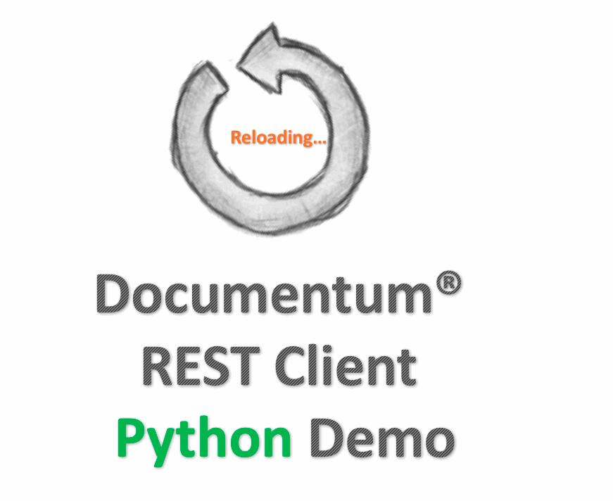

Documentum REST Python Client Samples
=========

[](https://www.python.org/download/releases/2.7/) 
[](http://www.apache.org/licenses/LICENSE-2.0)

This is a simple Python client for *Documentum REST Services*.

##What the demo demonstrates?

It will do the following jobs for your reference.  

```
0. Quit the demoo
1. Reset demo environment
2. REST sysObject CRUD
3. REST content management
4. REST version management
5. REST DQL
6. REST search with URL parameters
7. REST formats
8. REST network locations
9. REST relation CRUD
10. REST folder CRUD
11. REST type
12. REST batch
```


##Requirements
1. Python 2.7 - 3.5.
2. Library [request](http://docs.python-requests.org/en/latest/) is installed.
3. Package configparser and future are installed.
4. *Documentum REST Services 7.2* is deployed.


##Instruction
The instruction helps to prepare environment and run the demo.
As there would be different configuration for kinds of operating systems and Python versions, view the references via links provided.

1. Download and install [Python](https://www.python.org/downloads/)

2. Setup the environment according to the OS type: [Python 2.7.x](https://docs.python.org/2/using/) and [Python 3.5.x](https://docs.python.org/3.5/using/)

3. [Install pip](https://pip.pypa.io/en/stable/installing/).

4. Run command to install library [requests](http://docs.python-requests.org/en/latest/) and other dependencies.

   ```
   pip install requests

   pip install configparser

   pip install future	
   ```

5. Navigate to the project home directory.

        cd documentum-rest-client-python

6. Edit `rest.properties` or input the info when running the demo.

7. Run the command to execute the demo no matter Python 2 or Python 3 is installed.

        python RestDemo.py

##Demo

